# TP5 - Sistemas de Computación 2026  
## FCEFyN

### Integrantes
- José María Galoppo  
- Julián Moreyra  
- Pablo Díaz

### Repositorios

[Repositorio Moreyra](https://github.com/moreyrajulian/TP5-SdC-2026)

[Repositorio Galoppo](https://github.com/JoseMGaloppo/TP5-SdC-2026)

[Repositorio Diaz](https://github.com/Pablodadiaz/TP5-SdC-2026)

---

## Introducción general 

El objetivo fue **diseñar y construir un CDD** para Linux que
sensa **dos señales** con un período de **1 segundo**, junto con una aplicación de
usuario que lee **una** de esas señales y la **grafica en función del tiempo** a
través de una **interfaz web**. La aplicación le indica al driver cuál de las dos
señales leer, las correcciones de escala se hacen en el espacio de usuario, y al
cambiar de señal el gráfico se resetea y se acomoda a la nueva medición.

Todo el desarrollo se hizo con el enfoque de **compilación cruzada
(cross-compilation)**: el código se escribe en la PC de escritorio (host) y se
ejecuta en una arquitectura ARM, transfiriendo los binarios por **SSH**. Como no se
disponía de una Raspberry Pi física, se emuló una con **QEMU**.

## Marco teórico

### ¿Qué es un driver?

Un **driver** es una pieza de software que le permite al sistema operativo
interactuar con un dispositivo, creando una **abstracción del hardware**. Es como un
"manual de instrucciones" que indica cómo comunicarse con un dispositivo en
particular. Sin él, el hardware no se podría usar.

### Espacio de usuario vs. espacio de kernel

El sistema operativo divide la memoria y los privilegios en dos mundos:

- **Espacio de kernel:** donde corre el núcleo de Linux y los **módulos** (como
  nuestro driver). Tiene acceso directo al hardware. Un error acá puede colgar el
  sistema entero.
- **Espacio de usuario:** donde corren los programas normales (nuestra app `reader`,
  el navegador, etc.). No acceden al hardware directamente: lo hacen **a través del
  kernel**, usando *system calls* como `open`, `read`, `write`.

El driver nos funciona como **puente** entre estos dos mundos.

### Verticales de drivers y los CDD

En Linux los drivers se clasifican en tres "verticales" según cómo manejan los datos:

- **Network** (orientado a paquetes),
- **Storage/Block** (orientado a bloques),
- **Character** (orientado a bytes).

Nuestro driver es de la última: un **Character Device Driver (CDD)**. Es el grupo
más numeroso (puertos serie, audio, video, E/S básica, etc.).

### El modelo de capas de un CDD

```
   Aplicación de usuario  (reader / navegador)
            │  open() / read() / write()
            ▼
   Character Device File (CDF)   ->  /dev/SdeC_signals
            │  (Virtual File System del kernel)
            ▼
   Character Device Driver (CDD)  ->  sdec_signals.ko
            │
            ▼
   Dispositivo (en este TP: dos señales simuladas)
```

La aplicación nunca toca el hardware: abre un **archivo especial** en `/dev`, y el
kernel enruta esas operaciones hacia las funciones de nuestro driver.

### Número mayor y menor (`<major, minor>`)

El vínculo entre el archivo de `/dev` y el driver **no es por nombre, sino por
número**. Ese número es el par `<major, minor>`:

- el **major** identifica al driver,
- el **minor** identifica el dispositivo concreto dentro de ese driver.

En este TP el major se asignó **dinámicamente** (con `alloc_chrdev_region`) y
resultó ser el **237**.

### Constructor y destructor de un módulo

Un módulo de kernel es, conceptualmente, un objeto con un **constructor** y un
**destructor**:

- `module_init()` → se ejecuta al cargar el módulo con `insmod`.
- `module_exit()` → se ejecuta al descargarlo con `rmmod`.

### Compilación cruzada (cross-compilation)

La PC de desarrollo es **x86_64** (Intel/AMD), pero el destino es **ARM**. Por eso se
usa un **compilador cruzado** (`aarch64-linux-gnu-gcc`) que corre en x86 pero genera
binarios ARM. Así se desarrolla cómodo en la PC y se ejecuta en el dispositivo ARM.

### QEMU

**QEMU** es un emulador: crea por software una computadora completa (en nuestro caso
ARM de 64 bits) que corre dentro de la PC. Es la alternativa a tener una Raspberry Pi
física; el flujo de trabajo es el mismo (cross-compilar en la PC y enviar por SSH).

---

## Arquitectura de la solución

```
  [ Kernel ]                          [ Espacio de usuario ]
                                                              
  sdec_signals.ko                       reader (C)            server.py (Python)      Navegador
  ┌─────────────────┐                  ┌───────────────┐     ┌──────────────────┐    ┌──────────┐
  │ timer cada 1 s  │   /dev/SdeC_*    │ lee el device │     │ lanza el reader  │    │ Chart.js │
  │ senoidal+cuadr. │◀────read()──────▶│ corrige escala│────▶│ junta muestras   │◀──▶│ gráfico  │
  │ read() / write()│◀───write(1/2)────│ emite JSON    │     │ sirve /data y web│    │ en vivo  │
  └─────────────────┘                  └───────────────┘     └──────────────────┘    └──────────┘
       (sensa)                          (escala+selección)        (web)              (visualización)
```

**Responsabilidades de cada capa:**

- **`sdec_signals.ko` (kernel):** sensa las dos señales con un timer de 1 s, las
  guarda como valores **crudos** (enteros), y expone `read()`/`write()`. El `write()`
  permite elegir qué señal leer (`1` o `2`).
- **`reader` (usuario, en C):** abre el device, **corrige la escala** del valor crudo
  a Volts, y emite una línea JSON por segundo. Acá va lo "específico de usuario".
- **`server.py` (usuario, en Python):** lanza el `reader`, acumula las muestras y las
  sirve por HTTP (`/data`), además de la página y el endpoint `/select` para cambiar
  de señal (que dispara el reset del gráfico).
- **`index.html` (navegador):** dibuja el gráfico en vivo, muestra tipo/unidad/tiempo
  y resetea el trazo al cambiar de canal.

---

## Entorno de desarrollo

- **Host:** PC con **Ubuntu 24.04** (x86_64).
- **Emulador:** **QEMU 8.2.2** (`qemu-system-aarch64`).
- **Compilador cruzado:** `aarch64-linux-gnu-gcc` 13.3.0 (paquete `gcc-aarch64-linux-gnu`).
- **Target emulado:** máquina **`virt`** de QEMU corriendo **Debian 12 (arm64)**,
  kernel **`6.1.0-49-arm64`**.
- **Firmware UEFI:** `qemu-efi-aarch64`.

> **Nota sobre la elección del target.** Inicialmente se intentó emular una Raspberry
> Pi real (`-M raspi3b` con Raspberry Pi OS). El adaptador de red USB emulado de ese
> modelo resultó inestable (inundaba el log con `usbnet: failed control transaction` y
> el SSH se reseteaba), problema documentado en los foros de QEMU/Raspberry Pi. Por eso
> se migró a la máquina **`virt`** con **Debian arm64**, que tiene red **virtio**
> estable. El TP es indiferente a esto: el driver es portable entre máquinas ARM y el
> flujo de cross-compilación + SSH es idéntico.

---

## Desarrollo

### Fase 0 — Preparación del host

Se instaló el toolchain de compilación cruzada y QEMU:

```bash
sudo apt install -y build-essential git bc bison flex libssl-dev \
                    gcc-aarch64-linux-gnu qemu-system-arm qemu-utils \
                    qemu-efi-aarch64
```

Verificación:

```bash
aarch64-linux-gnu-gcc --version
qemu-system-aarch64 --version
```

### Fase 1 — Levantar el target en QEMU y entrar por SSH

Se descargó una imagen **Debian 12 nocloud arm64**, se ajustó su tamaño a una potencia
de 2 (requisito de la "SD" emulada) y se arrancó con red virtio y reenvío del puerto
SSH (host:5022 → guest:22):

```bash
qemu-img resize debian-12-nocloud-arm64.qcow2 +4G

qemu-system-aarch64 \
  -M virt -cpu cortex-a72 -smp 2 -m 2G \
  -bios /usr/share/qemu-efi-aarch64/QEMU_EFI.fd \
  -drive if=virtio,format=qcow2,file=debian-12-nocloud-arm64.qcow2 \
  -netdev user,id=net0,hostfwd=tcp::5022-:22 \
  -device virtio-net-pci,netdev=net0 \
  -nographic
```

Dentro de la VM se configuró SSH:

```bash
passwd
apt update && apt install -y openssh-server sudo build-essential
sed -i 's/^#\?PermitRootLogin.*/PermitRootLogin yes/' /etc/ssh/sshd_config
systemctl restart ssh
```

Y desde el host se entró con:

```bash
ssh -p 5022 root@localhost
```

Verificación del kernel destino:

```bash
uname -r   # 6.1.0-49-arm64
uname -m   # aarch64
```


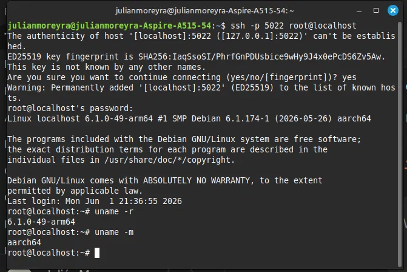

### Fase 2 — Primer módulo de kernel ("Hola kernel")

Antes de complicarse, se validó todo el ciclo *compilar → cargar → ver → descargar*
con un módulo mínimo. En la VM se instalaron los headers del kernel:

```bash
apt install -y linux-headers-$(uname -r)
```

Se compiló un módulo trivial, se cargó y se observó su mensaje en el log del kernel:

```bash
make
insmod hola.ko
dmesg | tail        # -> "Hola kernel, soy mi primer modulo!"
rmmod hola
dmesg | tail        # -> "Chau kernel!"
```

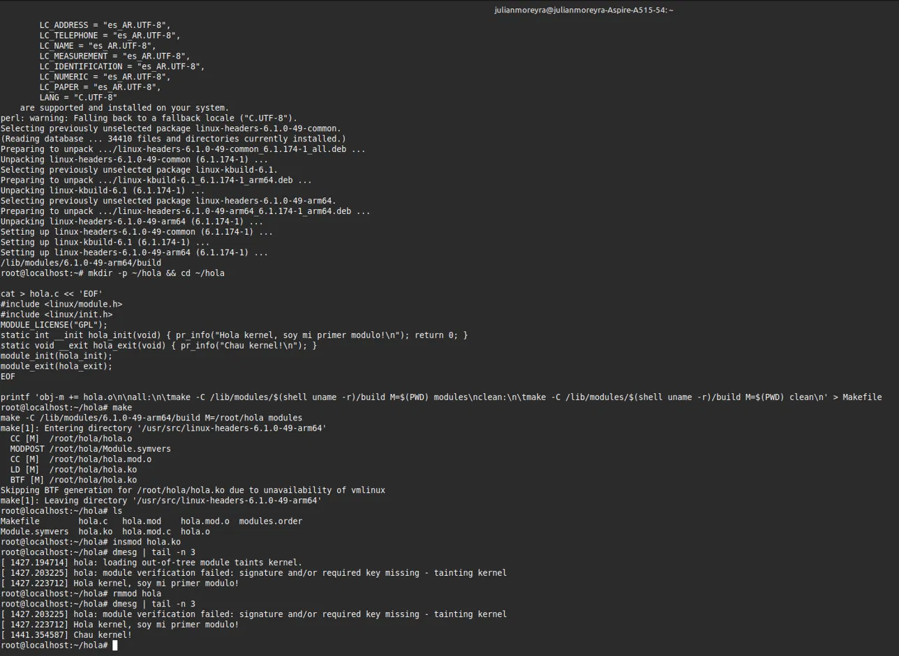

### Fase 3 — El CDD real (`sdec_signals`)

Se transfirió el código fuente del driver y su Makefile a la VM con `scp`, y se
compiló **dentro** de la VM (build nativo arm64, contra los headers que matchean el
kernel — esto garantiza que el *vermagic* coincida y el módulo cargue):

```bash
# en el host:
scp -P 5022 sdec_signals.c Makefile root@localhost:~/driver/

# en la VM:
cd ~/driver
make
insmod sdec_signals.ko
```

Verificaciones:

```bash
ls -l /dev/SdeC_signals          # crw------- ... 237, 0   (device creado por udev)
cat /proc/devices | grep SdeC    # 237 SdeC_signals
dmesg | tail                     # "SdeC_signals: cargado. major=237 minor=0"
```

Prueba manual (lectura y selección de señal, igual que con `cat`/`echo`):

```bash
cat /dev/SdeC_signals            # <senal> <tiempo> <valor_crudo>
echo -n 2 > /dev/SdeC_signals    # selecciona la señal 2
cat /dev/SdeC_signals            # ahora devuelve la cuadrada (0 / 1000)
```

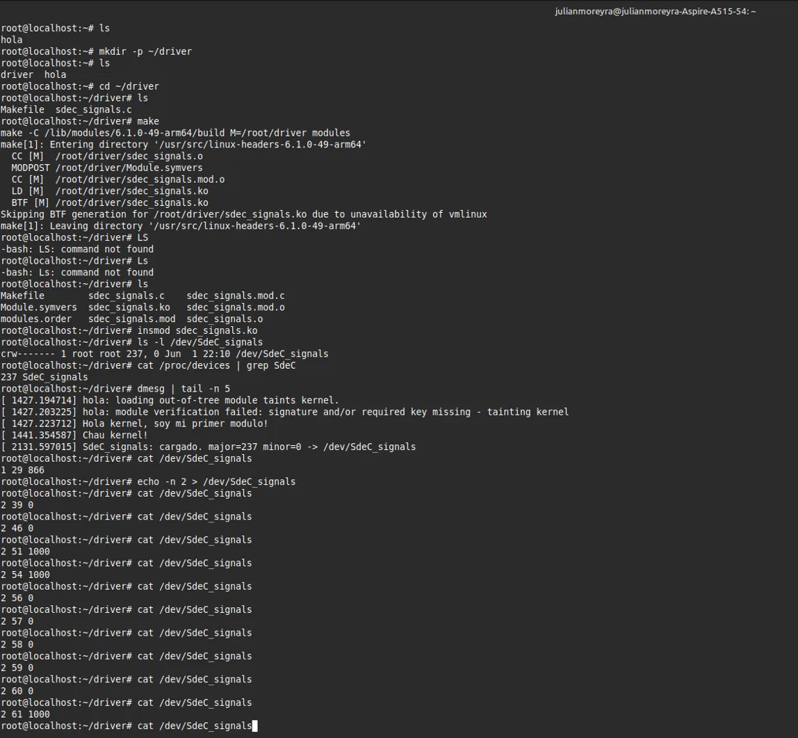

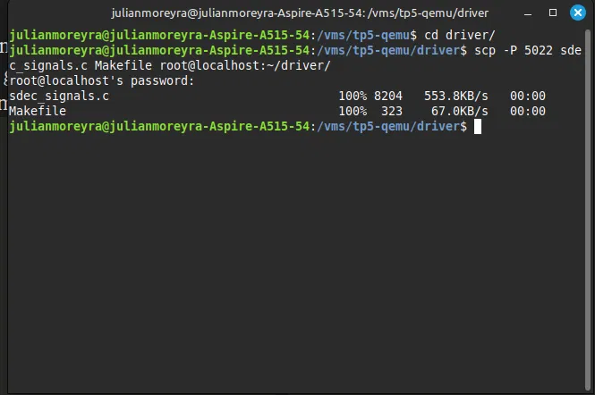

### Fase 4 — Aplicación de usuario (`reader`), **cross-compilada**

Acá se ejerce la compilación cruzada de verdad. En el **host** (x86) se compiló
apuntando a ARM64 y se verificó la arquitectura del binario:

```bash
aarch64-linux-gnu-gcc -O2 -Wall -static -o reader reader.c
file reader        # ELF 64-bit ... ARM aarch64 ...
```

Se transfirió el binario a la VM y se ejecutó:

```bash
# en el host:
scp -P 5022 reader root@localhost:~/driver/

# en la VM:
./reader 1 /dev/SdeC_signals
```

Salida (una línea JSON por segundo, con la **escala ya corregida a Volts**):

```json
{"signal":1,"type":"senoidal","unit":"V","t":789,"raw":-866,"value":-4.330}
```

Tipeando `2` y Enter cambia a la señal cuadrada; con `1` vuelve a la senoidal.

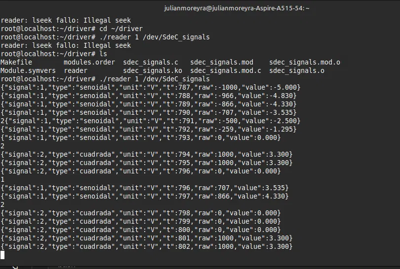

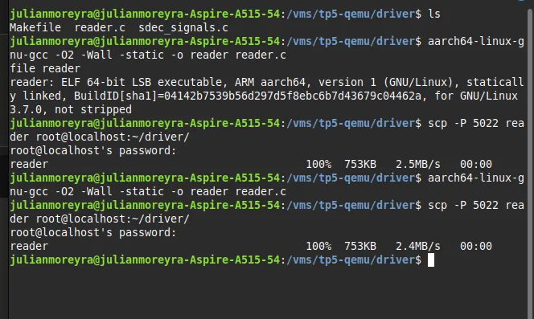


### Fase 5 — Interfaz web

Se transfirieron `server.py` e `index.html` a la VM. Como el navegador corre en el
host pero el servidor en la VM, se usó **reenvío de puerto por SSH**:

```bash
# en el host: este SSH abre la sesión Y tuneliza el puerto 8000
ssh -p 5022 -L 8000:localhost:8000 root@localhost

# dentro de la VM, en esa misma sesión:
cd ~/driver
python3 server.py --reader ./reader --dev /dev/SdeC_signals --port 8000
```

Luego, en el navegador del host: `http://localhost:8000`.

Se observa el gráfico dibujándose en vivo, con el tipo de señal, las unidades (V) y el
tiempo (s). Los botones **CH1 (senoidal)** y **CH2 (cuadrada)** cambian la señal: el
servidor se lo ordena al driver y **el gráfico se resetea** y se acomoda a la nueva
medición.

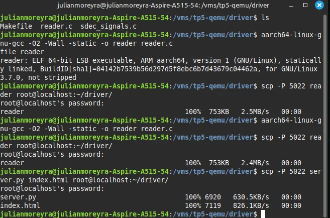

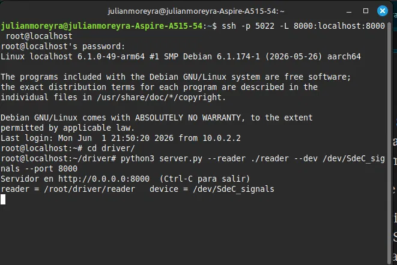

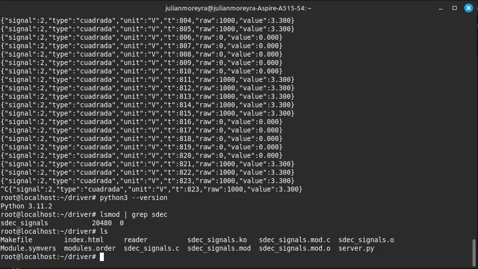

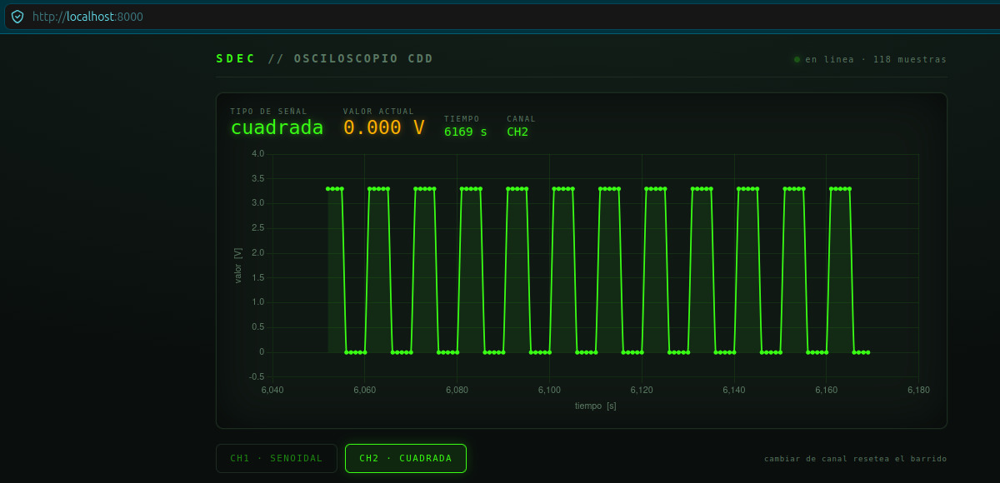

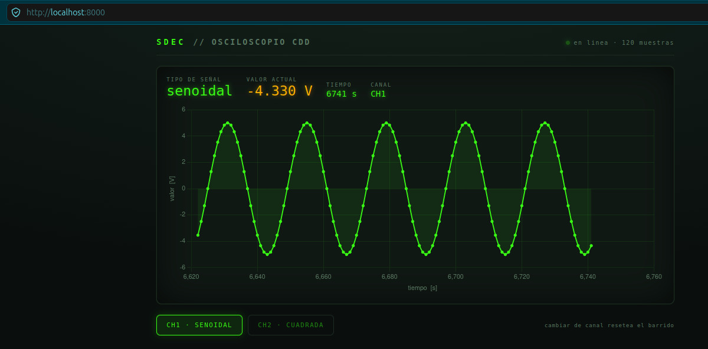

---

## Explicación del código

### El driver `sdec_signals.c`

Puntos clave:

- **Constructor/destructor:** `module_init(sdec_init)` y `module_exit(sdec_exit)`.
- **Registro del `<major, minor>`:** `alloc_chrdev_region()` (asignación dinámica).
- **Vínculo CDF↔CDD:** `cdev_init()` + `cdev_add()` con la estructura
  `file_operations` (que apunta a `my_open`, `my_read`, `my_write`, `my_release`).
- **Creación automática del `/dev`:** `class_create()` + `device_create()`; el demonio
  `udev` crea el archivo solo, sin `mknod` manual.
- **Sensado:** un `timer_list` que se dispara cada `HZ` jiffies (1 s) y calcula:
  - **Señal 1 (senoidal):** como el kernel **no puede usar punto flotante**, se usa
    una **tabla de enteros precalculada** con los valores de `sin(...)·1000`.
  - **Señal 2 (cuadrada):** alterna entre 0 y 1000 según el período.
- **`read()`:** arma una línea de texto `"<senal> <tiempo> <crudo>"` y la copia a
  espacio de usuario con `simple_read_from_buffer()` (que maneja el offset para que
  `cat` muestre una muestra y termine).
- **`write()`:** lee `'1'` o `'2'` y cambia la señal seleccionada.
- **Concurrencia:** como el timer corre en contexto atómico, las variables
  compartidas se protegen con un **spinlock** (no un mutex).

### La app `reader.c`

- Para **cada lectura abre el device, lee una línea y lo cierra** (igual que `cat`),
  porque el dispositivo es de flujo y no soporta `lseek`.
- **Corrige la escala** (función `scale()`): señal 1 de ±1000 → ±5,0 V; señal 2 de
  0/1000 → 0/3,3 V. *Esto es lo que pide la consigna: la corrección a nivel de
  usuario.* Si cambia el sensor, solo se toca esta función, sin recompilar el módulo.
- **Selecciona la señal** escribiendo `1`/`2` en el device, y emite la muestra en
  formato JSON.

### El servidor `server.py`

- Lanza el `reader` como **subproceso** y le lee la salida JSON.
- Mantiene en memoria las últimas muestras y las sirve en `/data`.
- `/select?signal=N` le escribe al `reader` para cambiar de señal e **incrementa un
  contador `epoch`** y limpia el buffer → eso provoca el reset del gráfico.

### La página `index.html`

- Usa **Chart.js**: pide `/data` cada segundo y dibuja la señal.
- Eje X = tiempo (s), eje Y = valor (V). Muestra el tipo de señal y la unidad.
- Cuando detecta que cambió el `epoch`, **limpia el gráfico** y arranca de cero.

---

## Decisiones de diseño y desvíos respecto de la consigna

1. **Máquina `virt` (Debian) en lugar de `raspi3b` (Raspberry Pi OS).** Se debió a la
   inestabilidad de la red USB emulada del modelo `raspi3b`. Se sigue cross-compilando en la PC y enviando por SSH a un Linux ARM emulado.

2. **El `.ko` se compiló dentro de la VM, no cross-compilado en la PC.** La razón es
   garantizar que el *version magic* del módulo coincida exactamente con el kernel
   destino (Debian), evitando que `insmod` lo rechace. Es equivalente a compilar en la
   propia Raspberry Pi. La **app de usuario sí se cross-compiló** en la PC, ejerciendo
   la compilación cruzada y la transferencia del binario por SSH.

3. **Señales simuladas en el kernel** (senoidal por tabla de enteros y cuadrada) en
   lugar de sensores físicos, dado que se trabajó sobre QEMU. La arquitectura admite
   reemplazar la fuente simulada por señales externas reales sin cambiar el resto del sistema.

---

## Conclusiones

Se construyó un Character Device Driver funcional que sensa dos señales, junto con una
aplicación de usuario y una interfaz web que las grafica en tiempo real. El trabajo
permitió comprender en la práctica:

- la diferencia entre **espacio de usuario y espacio de kernel**, y cómo un driver los
  conecta;
- el ciclo de vida de un **módulo de kernel** (`insmod`/`rmmod`, `module_init`/`module_exit`);
- el rol del par **`<major, minor>`** y la creación automática de archivos en `/dev`;
- las operaciones **`read`/`write`** como interfaz entre la app y el dispositivo;
- el flujo de **compilación cruzada** y transferencia por **SSH** hacia un target ARM;
- Cómo levantar todo esto sobre un entorno **emulado con QEMU**.

---
